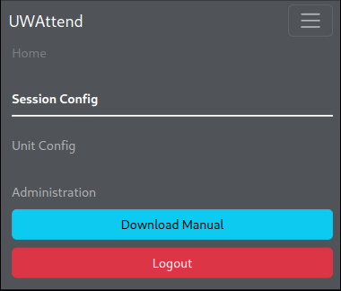
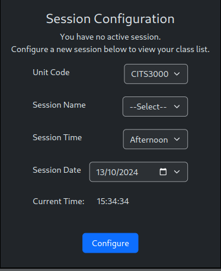

# UWAttend User Manual

Welcome to the UWAttend Web Application. This user manual will guide you through the primary functions of the website, including how to navigate the Home Page, Session Configuration, Unit Configuration, and the Administrator Page.

\newpage

## Navbar

{ width=50% }

The navigation bar is displayed at the top of your screen. This is the primary way to navigate through different sections of UWAttend. The navbar contains the following information:

- **Home**: Navigates to the Home Page. (Requires a session to be configured to navigate)
- **Session Config**: Navigates to the Session Configuration Page.
- **Unit Config**: Navigates to the Unit Configuration Page. (Coordinators and Admins ONLY)
- **Administration**: Navigates to the Administration Page. (Admins ONLY)
- **Download Manual**: Takes you to this user manual.
- **Logout**: Logs the user out of UWAttend.

## Session Configuration

This is the page you will be greeted at when you first log into UWAttend. The session configuration page allows facilitators to set up a new session for a course. A *session* refers to a specific class event (e.g., a lab, tutorial or workshop) linked to a unit (course), where attendance is recorded. This page is crucial for setting up the details of the session before students can sign in or out.

### Configuring a Session
You will be prompted to configure the session details for your class. Fill out details for the class you are facilitating. Below are the details for each entry:

1. Unit Code
- The **Unit Code** allows you to select the course associated with the session you are facilitating.

2. Session Name
- The **Session Name** allows you to specify the type of session you're facilitating (e.g., Lab, Tutorial, Workshop).

3. Session Time
- The **Session Time** allows you to indicate the time of day when the session is occurring.
- Depending on how your unit is configured you will either have the following options:
  - **Morning or Afternoon**: You will have the option to select whether the session is the Morning or Afternoon session.
  - **Hourly**: You will have the option to select what time the class starts by the hour.

4. Session Date
- The **Session Date** specifies what date the session is being held.
- By default it will show the current day but you have an option to change it if required.

5. Current Time
- The **Current Time** is automatically displayed to reflect the system's real-time clock.

Once you have filled out your session details. You can click the **Configure** button which will redirect you to the **Home Page**.

## Home Page
### Overview

[Insert home page here]

The Home Page serves as the central dashboard where facilitators manage the session in progress, sign in and out students and access student information.

### Session Information Display

[Insert session display here]

At the top of the page, the current session title is prominently displayed. This includes details such as:

- The unit name (Computing)
- The semester (SEM2)
- The session name (Workshop)
- The session date (2024-10-08)
- The session time (Morning)

This information help facilitators keep track of which session they are managing.

### Signing Individual Students In/Out

[Insert search bar here]

To sign in a student, use the search bar with the submit button to type in the student you want to sign in. You can search for a student by the following criteria:

- Full name
- Student Number
- Preferred Name

A student who is not signed into the current session will be highlighted **GREEN** to indicate you are signing this student in. A student who is signed into the current session will be highlighted **RED** to indicate you are signing this student out.

[insert green and red student here]

Once a student is selected to be signed in, you may be prompted to ask the student if they consent to their photograph being taken in this class. If the student agrees then select **YES**. If they do not then select **NO**. If selected no, you will prompted to ask again everytime this student attends the class again.

As you sign in students, the page will update to show how many students have signed in and how many are expected to attend (e.g., "10 signed in of 10").

To sign out a student, use the same search bar with the submit button and type in the student you want to sign out. A message will appear saying you have signed out this student. 

### Viewing Student Information

[insert student page here]

Once a student has been signed in, you can click on each student's name from that list that appears. This will bring up a page which allows facilitators to review and update details related to individual students within a session. 

The page contains the following information:

- **Student Name**: Displays the full name of the student
- **Student ID**: Displays the UWA student ID
- **Sign-in Time**: Displays the time the student signed in
- **Sign-out Time**: Displays the time the student signed out
- **Login Button**: If ticked, the student is signed in the session, if not then they are not signed in the current session. 
- **Photo Consent Button**: This checkbox indicates whether the student has given consent for photographs or not.
- **Grade Field**: Facilitators can input or edit the student's grade for the session in this field.
- **Leave/edit Comments**: Facilitators can leave notes or comments regarding the students participation, behaviour or any other relevant information during the session.
- **Remove Student**: Used to remove a student from a session. This is will REMOVE them from the class entirely.

You may wish to save any changes you made on this page by clicking the "Save Changes" button. If you wish to revert or go back to the home page then click "Cancel".

### Class List Search

[Insert search here]

If the class list is long and you wish to search for a student who is signed in the class, you can use the class list search bar. This will filter out a student by either their name or student ID.

### Sign All Students Out

[insert button here]

At the bottom of the page is a "Sign All Out" button. This allows the facilitator to sign out all students in the session simultaneously, which is useful at the end of a session.

Before you sign all the students out, make sure to do a head count and see if that number matches the signed in students number. If it does you can safely sign all students out. Otherwise, search through the class list to see which students are missing.

### Exiting the Session
Once the session has concluded or you wish to leave your current session, you can click the "Exit Session" button. This will close the session and erase the current session progress. It will then take you to the "Session Configuration" page to start a new session.

## Unit Configuration (Coordinators and Admin ONLY)

[Insert Unit Configuration page here]

This page is used to manage units (courses) within UWAttend. Only **coordinators** and **administrators** have access to this page, allowing them to add, configure and export data for the units they manage. 

### Unit List Overview
You will see a list of all the units that you, as a coordinator or administrator have control over. Each unit entry displays the following information:

- **Unit Code**: The unit code for the unit.
- **Unit Name**: The name of the unit.
- **Study Period**: The semester that the unit is taking place in.
- **Start Date**: The date of when the unit begins.
- **End Date**: The date for when the unit ends.

### Exporting Unit Data

[Insert Export buttons here]

For each unit, you have the ability to export all the related information into CSV  files. There are two options for exporting unit information from UWAttend:

- **Exporting All Units**: You can download information regarding all units on the page by clicking the **Export All Units** button at the top of the screen. This will combine all units together and export them into CSV files.

- **Exporting Individual Units**: Alternatively, you can export data for an individual unit by clicking the **Export** button next to the relevant unit in the list. 

The following files will be generated when exporting if they are populated:

- **students.csv**: Displays a list of all the students enrolled in the unit.
- **users.csv**: Displays a list of all the user accounts in UWAttend. (**Only the admin account will receive this file**).
- **attendance.csv**: Displays a list of all the attendance records for the unit. This is how the database stores the attendance details
- **sessions.csv**: Displays a list of all the sessions that have been created for the unit
- **unit.csv**: Displays the unit information
- **attendancerecord.csv**: Displays a list of all the attendance records for the unit. Each row in the list will be an attendance record. This list is more human readable and should be used when coordinators are examining information about students attendance in a unit.
- **attendancerecordCOLUMNS.csv**: Displays a list of all the attendance records for the unit. Each row in the list will be a unique student and each column will contain information for each session time. Again, more human readable and should be used when coordinators are examining information about students attendance in a unit. 

### Adding New Units
Clicking the **Add Unit** button will take you to a new page where you will be able to configure a new unit.

[Insert add unit page here]

In the form, you will need to enter the following details:

- **Unit Code**: The unit code for the unit (e.g., CITS3200)
- **Semester**: The semester that the unit will take place (e.g., SEM1, SEM2)
- **Unit Name**: The name of the unit (e.g., Professional Computing)
- **Start Date**: The date the unit will start.
- **End Date**: The date the unit will end.
- **Session Names**: The types of sessions that will take place for the unit. (e.g., Lab, Tutorial, Workshop)
- **Session Occurrence**: Determines how frequently the sessions will occur per day. Below is the types of session occurrences you can select from: 
  - Morning/Afternoon: The unit has morning and afternoon sessions
  - Hourly: The unit has sessions that occur multiple hours a day
- **Comment Suggestions (OPTIONAL)**: If comments are enabled, you predefine comment suggestions that can be used by facilitators when filling out comments for a student. You can leave blank if no suggestions are needed (e.g., nomark, good behaviour). 
- **Photo Consent Required?**: Indicates whether photo consent is required for this unit.
- **Sessions Assessed?**: Indicates whether sessions for the unit are graded.
- **Comments Enabled?**: Determines whether the comment feature will be enabled during sessions.
- **Facilitator List CSV Upload**: Upload a CSV file containing the list of facilitators that will be running the sessions for the unit. This will assign the unit to all the facilitators that are in the CSV file. You may click the **Download facilitator template** to download a CSV file that contains the correct formatting for the upload. 
- **Student List CSV Upload**: Upload a CSV file containing the list of students that are enrolled in the unit. This will assign the unit to all the students that are in the CSV file. You may click the **Download student template** to download a CSV file that contains the correct formatting for the upload

### Editing an Existing Unit

Clicking a unit in the list will take you to a new page where you will be able to edit a preexisting unit.

[Insert edit page here]

In the form, you can edit the following details:

- **Unit Code**: The unit code for the unit (e.g., CITS3200)
- **Semester**: The semester that the unit will take place (e.g., SEM1, SEM2)
- **Unit Name**: The name of the unit (e.g., Professional Computing)
- **Start Date**: The date the unit will start.
- **End Date**: The date the unit will end.
- **Session Names**: The types of sessions that will take place for the unit. (e.g., Lab, Tutorial, Workshop)
- **Session Occurrence**: Determines how frequently the sessions will occur per day. Below is the types of session occurrences you can select from: 
  - Morning/Afternoon: The unit has morning and afternoon sessions
  - Hourly: The unit has sessions that occur multiple hours a day
- **Comment Suggestions (OPTIONAL)**: If comments are enabled, you predefine comment suggestions that can be used by facilitators when filling out comments for a student. You can leave blank if no suggestions are needed (e.g., nomark, good behaviour). 
- **Photo Consent Required?**: Indicates whether photo consent is required for this unit.
- **Sessions Assessed?**: Indicates whether sessions for the unit are graded.
- **Comments Enabled?**: Determines whether the comment feature will be enabled during sessions.

### Edit Students for each unit
Clicking the **Edit Students** button when editing an existing unit will take you to a new page where you can see all the students currently enrolled in the unit.

[Insert editstudents here]

#### Student List for Unit

The page will display a list of all the students currently enrolled in the unit. It displays information about their student number and there full name and a **Delete** button to remove them from the unit.

#### Upload Students (CSV)

If you want to add multiple students to a unit at the same time, you can upload a CSV file that is the same format as the **student template**. This will upload any students in that list that don't already exist. If they do exist, they will be ignored.

#### Add Student (Manually)

If you want to add a single student to a unit, you can fill in the **Add Student** form. Fill in the following details for the student you want to add:

- **Student Number**: The students 8-digit UWA number (e.g., 12345678)
- **Title**: The student's title (e.g., Mr., Ms.)
- **First Name**: The student's first name.
- **Last Name**: The student's last name.
- **Preferred Name**: If the student has a preferred name.

### Edit Facilitators for each unit
Clicking the **Edit Facilitators** button when editing an existing unit will take you to a new page where you can see all the facilitators currently enrolled in the unit.

[Insert editfacilitator here]

#### Facilitator List for Unit

The page will display a list of all the facilitators currently enrolled in the unit. It displays information such as their email address and their full name and a **Delete** button to remove them from the unit.

#### Add Facilitator
If you want to add a facilitator, type in the email address for the facilitator you want to add to the unit. This will send them an email asking them to create their account for UWAttend. Once created, they will be added as a facilitator for the unit.

## Administration Page (Admins ONLY)

This page allows administrators to manage users within the system by adding new users and viewing existing ones.

### Adding A New User
To add a new user, you must select what type of user you would like to add from the dropdown menu. You can select from the following roles:

- **Administrator**: Users will full access to the system, including unit and user management.
- **Coordinator**: Users who manage specific units and have access to session and student data.

Once the role has been selected, fill out the email address of the user. This will send them an email asking them to verify and activate their account. Once verified, their details will be updated in the system and they will have access to UWAttend.

### Existing User List
This section of the page displays all users who are currently registered in the system. Each row in the list contains important details about each user.

- **Email**: The email address of the user.
- **Name**: The full name of the user.
- **User Type**: The type of user (e.g. admin, coordinator)
